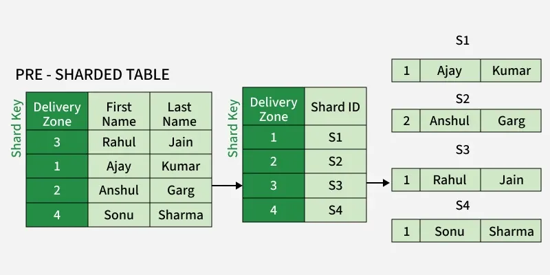

# Database Sharding

Database Sharding is the process of dividing a single large database into multiple smaller databases called **shards**.

A single database can become a bottleneck when it is the only database storing and serving the data. Database Sharding helps in **Horizontal Scaling** by distributing the data across multiple machines.

## Types of Database Sharding

### 1. Range-Based Sharding (Horizontal Sharding)

In this sharding, the data is divided based on a range.

Let's say we have **10 million users**. We can allocate one shard for every **1 million users** based on the **User ID**.

Example:
- Shard 1 → User ID (1 - 1,000,000)
- Shard 2 → User ID (1,000,001 - 2,000,000)
- and so on...

It is helpful when we need to perform **range-based queries**.

#### Challenge

New users always get a new User ID, so they are stored in the latest shard. This makes the latest shard a **hotspot** because it becomes much more active than the older shards, resulting in an uneven distribution of active user load.

---

### 2. Key-Based Sharding

In this sharding, we create the hash of the **User ID** using a formula like:

```text
Hash(UserID) % NumberOfShards
```

The result gives the index of the shard where the data will be stored.

This solves the hotspot issue of Range-Based Sharding because the data is distributed across multiple databases, so the transaction load is balanced.

#### Challenge

Range-based queries become difficult because the data is distributed using the hash of the key. To find all records within a range, multiple shards need to be searched.

---

### 3. Vertical Sharding

In this sharding, we split the database based on **columns**.

For example, in a **Student** table containing:
- Student ID
- Student Name
- Email ID

We can split it into two shards:

- Shard 1 → Student ID, Student Name
- Shard 2 → Student ID, Email ID

Here, **Student ID** acts as the Primary Key in one shard and is used as a Foreign Key to relate the data in the other shard.

---

### 4. Directory-Based Sharding

In this sharding, we have a **Lookup Table** that maps the keys to the shard.

When someone searches for a record, the Lookup Table is checked first to identify which shard contains the data. Once the shard is identified, the data is fetched from that shard.



---

### 5. Geographical-Based Sharding

In this sharding, the data is stored based on the geographical location.

For example:
- Data for **India** is stored in the **India Shard**.
- Data for the **USA** is stored in the **USA Shard**.