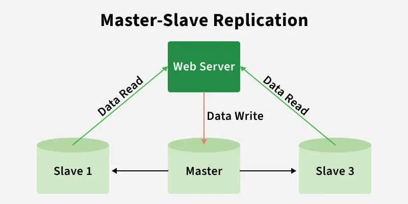
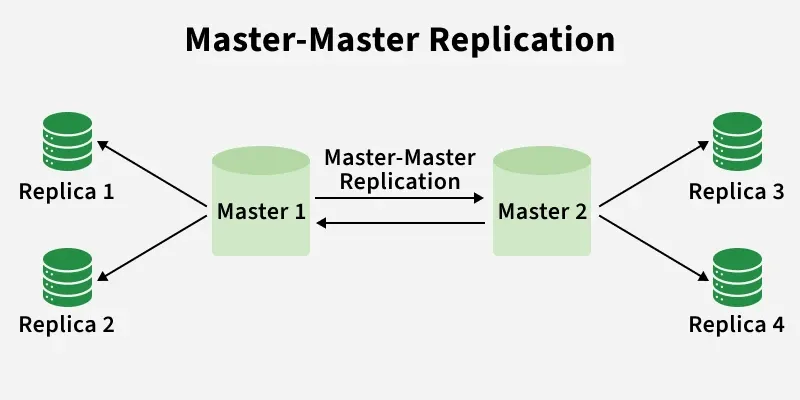
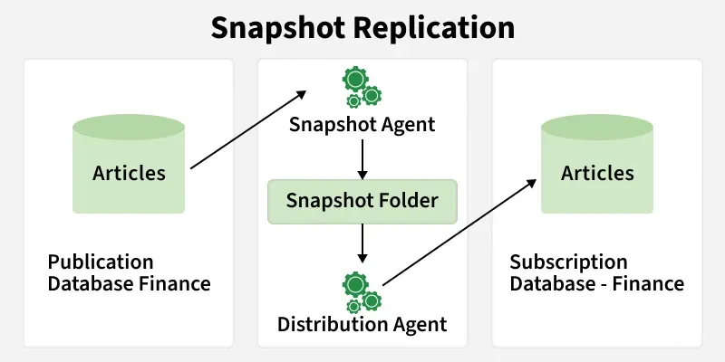
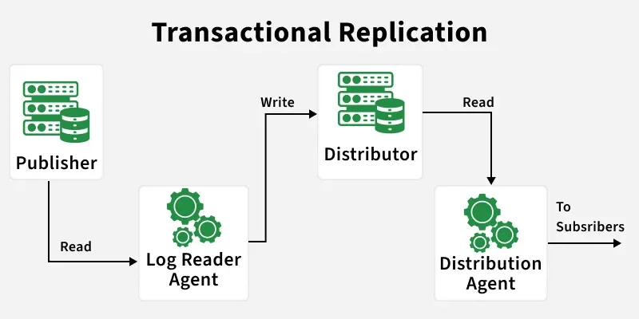
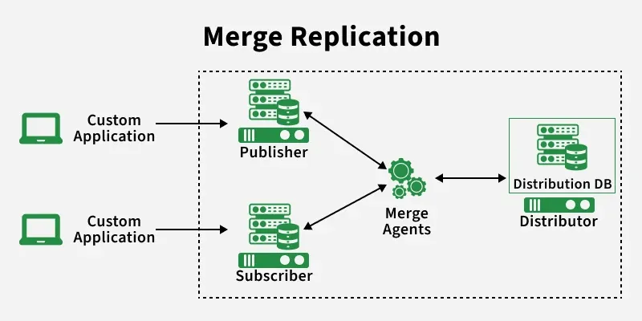

# Data Replication

Data Replication is the process of copying and maintaining data across multiple databases to ensure reliability and consistency in case of failures.

## Types of Data Replication

### 1. Master-Slave Replication

In this type, there is one **Master (Primary)** database that handles all **write operations** (Insert, Update, Delete). The data is then synchronized to one or more **Slave (Secondary)** databases, which mainly handle **read operations**.

#### Working

- The Primary database records the changes in the transaction log.
- The replication thread reads the transaction log.
- The data is transferred from the Master to the Slave databases over the network.
- The Slaves receive the data and send an acknowledgment.

#### Challenges

- The Master database can become a **Single Point of Failure (SPOF)**.

---

### 2. Master-Master Replication

In Master-Master Replication, there is more than one Master database. Any write operation performed on one Master is synchronized with the other Master databases.

#### Working

- Changes made by one Master database are recorded in the transaction log.
- The replication thread reads the transaction log.
- The changes are sent over the network to the other Master databases.
- All Masters receive the data and send an acknowledgment.

#### Challenges

- Conflict resolution becomes complex when multiple Masters update the same resource at the same time.
- Maintaining data consistency is a challenge.

---

### 3. Snapshot Replication

In Snapshot Replication, the **Publisher** publishes a copy (snapshot) of the database at a specific point in time. The snapshot is stored at the **Distributor**, and the **Subscribers** receive the copied data.

#### Challenges

- Multiple copies of the database can cause storage issues.

---

### 4. Transactional Replication

Unlike Snapshot Replication, Transactional Replication does not wait for a scheduled time. Whenever a change occurs, it is synchronized with the other replicas almost immediately.

#### Working

- The Publisher collects changes such as Insert, Update, and Delete operations.
- These changes are transferred through the Distributor.
- The Distributor sends the changes to all Subscribers.

---

### 5. Merge Replication

In Merge Replication, both the **Publisher** and **Subscribers** can modify the data.

It is useful for applications where users work offline and synchronize their changes once they come back online.

A common example is a shared document that is edited by multiple users while offline. When they reconnect, all the changes are merged.

